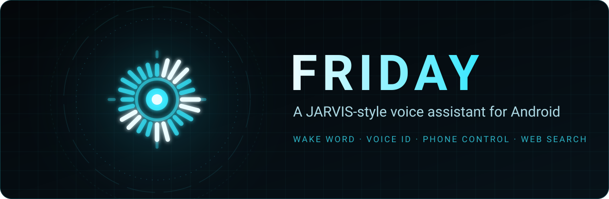
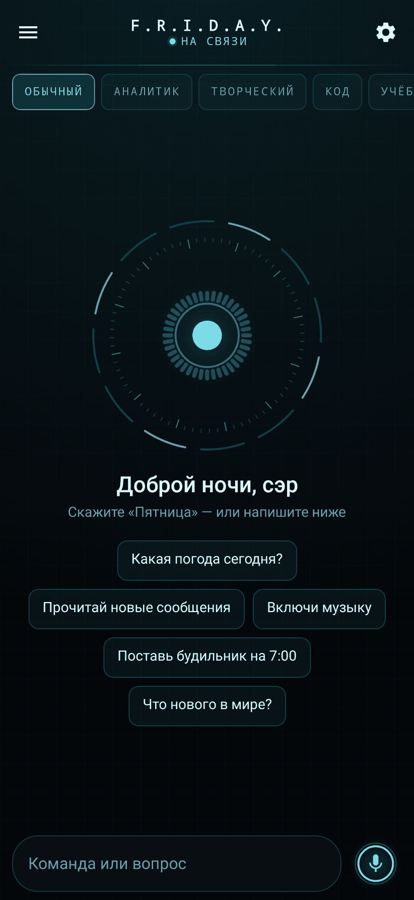
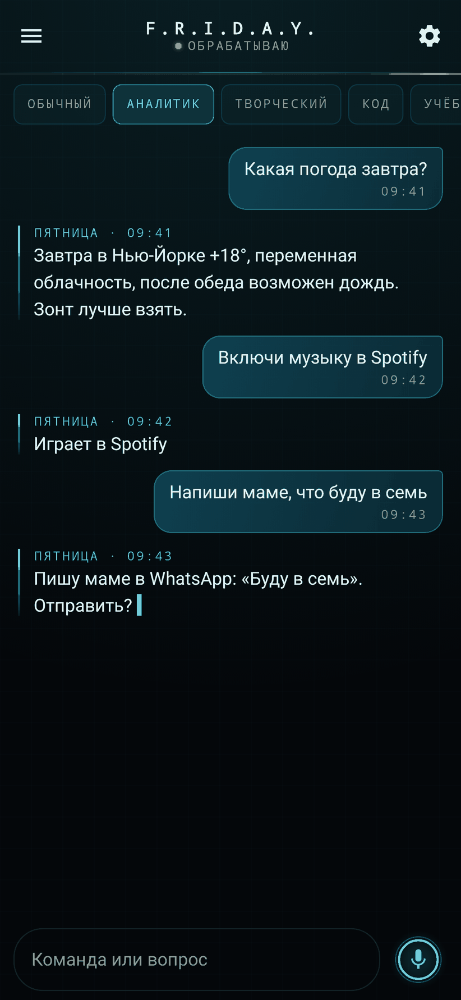
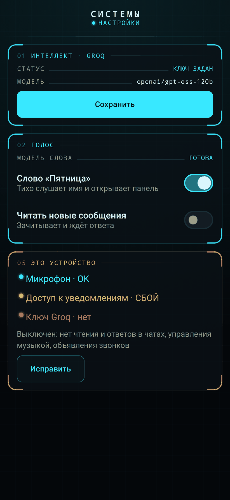
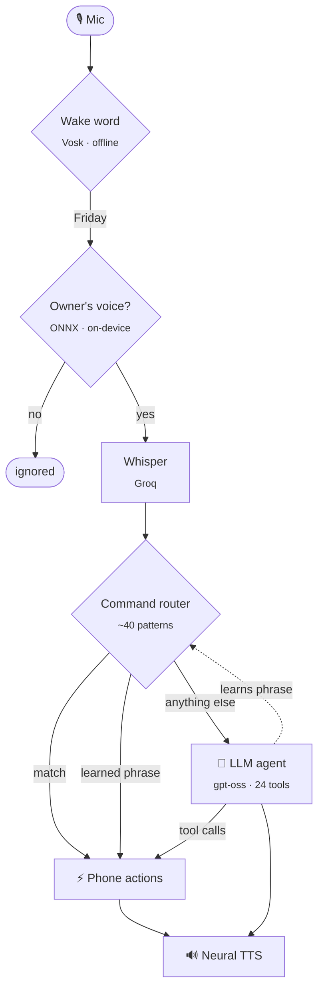

<div align="center">



<br>

**English** &nbsp;|&nbsp; [Русский](README.ru.md)

<br>

[](https://github.com/n1dlee/friday-mobile/releases)
[](https://github.com/n1dlee/friday-mobile/releases)
[](https://github.com/n1dlee/friday-mobile/actions/workflows/ci.yml)
[](LICENSE)

[](#-installation)
[](https://kotlinlang.org)
[](https://developer.android.com/jetpack/compose)
[](https://groq.com)
[](https://onnxruntime.ai)

<br>

*Say "Friday". She answers — and then she actually does it.*

<br>

<a href="https://github.com/n1dlee/friday-mobile/releases/latest"></a>

</div>

---

Friday is a hands-free personal assistant for Android in the spirit of J.A.R.V.I.S. and F.R.I.D.A.Y. from Iron Man. It waits silently for its name, listens only to its owner's voice, and carries things out on the phone: alarms, calls, messages, music, settings, the calendar, mail. When a request doesn't fit a known command, a language model with tools works it out, and Friday reports only what was actually done.

> [!NOTE]
> Friday is a personal project in **preview**. It needs a free [Groq API key](https://console.groq.com/keys) and a 64-bit Android phone (Android 8.0+). The interface and voice are tuned for **Russian and English**.

<div align="center">
&nbsp;
&nbsp;

</div>

## ✨ Highlights

<table>
<tr>
<td width="50%" valign="top">

### 🎙️ Silent wake word
Offline keyword spotting with [Vosk](https://alphacephei.com/vosk/). No beeps or system mic indicator, no audio leaves the phone until you say the name.

### 🔐 Your voice only
An on-device speaker-verification model (ResNet34, ONNX Runtime) checks both the wake word and the command. A stranger's voice, or the TV, is ignored.

### ⚡ Two-tier brain
About 40 everyday commands run straight on the phone in milliseconds. Everything else goes to an LLM agent with **24 tools**. Phrases the agent works out are **learned**, so next time they skip the model.

</td>
<td width="50%" valign="top">

### 🧭 Decides like a person would
"Text mum" picks SMS, WhatsApp or Telegram from her number's country, yours, and the apps she uses. "Call mum" abroad becomes a WhatsApp call. Every choice comes with the reason.

### 💬 Reads and answers your chats
Announces callers and quietly collects WhatsApp/Telegram/SMS, skipping shops, banks and codes. Ask "any unread messages?" and Friday names who wrote and asks whose first; long chats are summarised. "Reply: sure" answers the chat just read, through the notification itself, without opening the app.

### 🌐 Knows what's current
Web search via Groq's browser tool for news, prices and scores. Real weather from [Open-Meteo](https://open-meteo.com). The calculator handles arithmetic, not the model's head.

### 🎛️ Modes you create by voice
*"Create a rest mode: fully silent, Do Not Disturb, lowest brightness."* Friday works out the steps once and reads them back. After that, *"rest mode"* runs them with no model, *"turn off rest mode"* puts everything back, and they can run on a schedule. If you keep starting a mode at the same hour, Friday offers to do it for you.

</td>
</tr>
</table>

## 🗣️ Try saying

| You say | Friday |
|---|---|
| *"Friday… set an alarm for 7:30 and tell mum I'll be late"* | Sets the alarm, then opens WhatsApp to mum with the text filled in (her number is abroad) |
| *"Call dad"* | Calls by phone at home, or over WhatsApp if he is abroad, and says which |
| *"What did mum write?"* → *"Reply that I'm on my way"* → *"Yes"* | Reads the chat, reads your reply back, sends it |
| *"Play Believer on Spotify"* · *"Stop the music"* · *"What's playing?"* | Search and play, pause, now-playing from the media session |
| *"Who won the last World Cup?"* | Searches the web and answers with the source |
| *"Volume to 50"* · *"Flashlight off"* · *"Open Bluetooth settings"* | Done on the phone directly, no model involved |
| *"Create a sad mode: Spotify with sad songs"* → *"Sad mode"* → *"Turn off sad mode"* | Saves the mode and reads it back, runs it without the model, then pauses the music it started |
| *"Start rest mode every day at 11 pm"* | Runs the mode by itself at that time and posts a quiet note of what it did |
| *"Start driving mode when I connect to the car"* | Learns which Bluetooth device the car is, and says the mode aloud each time you get in |
| *"Link rest mode to a tag"* | Writes a signed NFC tag; touching it turns the mode on and off, even with Friday closed |
| Long-press the side button · the Quick Settings tile | Friday listens, as if you'd said her name |
| *"Remind me tomorrow at 9 to call the doctor"* | Calendar event with a reminder |
| *"Remind me to buy milk"* | Location-based errand: pings you near a shop |

## 🧠 How it works



- **Commands first.** Everyday requests never reach the model. They are faster, cost no tokens, and can't be hallucinated. The panel shows who answered: `Friday · command` or `Friday · AI`.
- **The agent fills the gaps.** Natural phrasing ("bump the alarm to half seven"), multi-part requests, reasoning. The model may only *act* through tools and must report what the tools returned. A rule in the prompt and a note on every tool result enforce this.
- **Cheap by default.** Small talk goes with a light tool kit (~1k tokens). The model escalates to the full phone toolset only when it needs it.
- **Honest failures.** If the Clock app didn't create the alarm, Friday checks with `AlarmManager` and says so instead of "done".

## 📥 Installation

1. Download **`Friday-x.y.z.apk`** from the [latest release](https://github.com/n1dlee/friday-mobile/releases/latest) and install it. Allow installs from your browser when Android asks.
2. Open **Settings** in Friday:
   - paste your **Groq API key** (free at [console.groq.com](https://console.groq.com/keys));
   - **download the voice model** (~45 MB, once) and turn on **Wake word**;
   - **record your voice profile**: eight short phrases, about a minute.
3. Grant the permissions as features ask for them: microphone, overlay, contacts, phone, notifications access (for chats and music), location (for weather and errands).
4. Say **"Friday"**.

<details>
<summary><b>Permissions and why</b></summary>

| Permission | Used for |
|---|---|
| Microphone, foreground service | Wake word and commands |
| Display over other apps | The listening panel |
| Contacts, phone, SMS | "Call mum", "text dad" |
| Notification access | Reading and replying to chats, controlling music, "what did I miss" |
| Calendar | Events and reminders |
| Location | Weather "here", errands near shops |
| Camera, flashlight | "Take a selfie", "flashlight on" |
| Ignore battery optimisation | Keeps the wake word alive on Samsung and Xiaomi |

</details>

## 🔐 Privacy

- **Nothing is recorded until the wake word.** Spotting runs offline. Your voice profile is a 256-number vector that never leaves the phone.
- After the wake word, the **command audio** goes to Groq for transcription. The **text** goes to Groq for answers and to Microsoft's Edge read-aloud service for the voice.
- **Chats are held in memory only**, never written to storage. Friday's memory of you lives in a local database.
- No analytics, no ads, no accounts. Your API key stays on your phone and is **never compiled into the app**.

## 🛠️ Tech stack

| Layer | Technology |
|---|---|
| UI | Kotlin 2.1, Jetpack Compose, Material 3 |
| Architecture | Clean architecture (UI → use cases → repositories), MVVM + StateFlow, Koin DI |
| Storage | Room, WorkManager |
| Wake word | Vosk (grammar-constrained keyword spotting) |
| Speaker verification | wespeaker ResNet34 on ONNX Runtime, Kaldi-compatible fbank in Kotlin |
| Speech-to-text | Whisper large-v3-turbo via Groq |
| LLM | `openai/gpt-oss-120b` / `20b` via Groq, streaming tool calls, browser search |
| Text-to-speech | Microsoft Edge neural voices (Svetlana / Emily) |
| Phone numbers | Google libphonenumber |
| Quality | 600+ unit tests (JUnit, MockK, coroutines-test), detekt |

## 🏗️ Project structure

```text
app/src/main/java/com/friday/ai
├── agent/        LLM agent: tools, light/full kits, calculator, learned commands
├── command/      CommandExecutor and its phone / planner / info actions
├── core/         Pure logic: router, parsers, voice gate, fbank, people & channels
├── data/         Room database, Groq / Gmail / weather clients, settings export
├── domain/       Models and use cases
├── service/      Wake-word service, voice loop, TTS, notifications, mail, workers
└── ui/           Compose screens: chat, settings, dashboard, overlay
```

## 🔨 Building from source

Requirements: **JDK 17 or 21** (not 25), Android SDK 35.

```bash
git clone https://github.com/n1dlee/friday-mobile.git
cd friday-mobile
./gradlew assembleDebug          # APK in app/build/outputs/apk/debug/
./gradlew assembleRelease        # minified with R8, ~26 MB, in app/build/outputs/apk/release/
./gradlew testDebugUnitTest      # unit tests
./gradlew detekt                 # static analysis
./gradlew verifyReleaseKeepRules # R8 kept the classes native code looks up by name
```

No secrets are needed to build. Your Groq key goes into the app's Settings, not the build. Without `keystore/friday.keystore` the build is signed with your SDK's debug key (see [keystore/README.md](keystore/README.md)).

## 🗺️ Roadmap

- [x] Silent wake word, speaker verification, continuous conversation
- [x] LLM agent with tools, learned commands, web search
- [x] Context-aware messaging and calls (SMS / WhatsApp / Telegram)
- [x] Chats from notifications: read, reply, announce
- [x] Encrypted key storage, diagnostics screen, verified hand-offs to other apps
- [x] Move to a new phone: everything in one passphrase-encrypted file
- [x] Modes you create by voice ("create a sad mode: Spotify with sad songs"), with automatic undo, schedules and learned habits
- [x] Modes triggered by NFC tags, the car's Bluetooth, the charger, home Wi-Fi
- [x] Side button, Quick Settings tile and launcher shortcuts; a handwriting notebook for the S Pen
- [ ] Full system assistant: screen context and a session window (VoiceInteractionService)
- [ ] Samsung DeX: right display, desktop layout
- [ ] Camera "what is this?", Health Connect

## 🤝 Contributing

Issues and pull requests are welcome. Before opening a PR, please run:

```bash
./gradlew testDebugUnitTest detekt
```

Keep logic that can be pure out of Android classes, so it can be unit-tested, and match the surrounding code style.

## 🙏 Acknowledgements

- Speaker model: [wespeaker](https://github.com/wenet-e2e/wespeaker) `voxceleb_resnet34_LM`, licensed [CC BY 4.0](https://creativecommons.org/licenses/by/4.0/). Weights converted to float16 storage, otherwise unchanged.
- [Vosk](https://alphacephei.com/vosk/) speech recognition toolkit (Apache 2.0) and its small Russian model.
- [ONNX Runtime](https://onnxruntime.ai) (MIT), [libphonenumber](https://github.com/google/libphonenumber) (Apache 2.0), [OkHttp](https://square.github.io/okhttp/), [Koin](https://insert-koin.io).
- Weather data by [Open-Meteo.com](https://open-meteo.com) (CC BY 4.0).
- Inference by [Groq](https://groq.com).
- Inspired by J.A.R.V.I.S. and F.R.I.D.A.Y. from the Marvel films. This project is not affiliated with Marvel or Disney.

## ⭐ Star history

<a href="https://star-history.com/#n1dlee/friday-mobile&Date">
  <picture>
    <source media="(prefers-color-scheme: dark)" srcset="https://api.star-history.com/svg?repos=n1dlee/friday-mobile&type=Date&theme=dark">
    
  </picture>
</a>

## 📄 License

Released under the [MIT License](LICENSE).

<div align="center">
<sub>Built with ☕ and a lot of "Пятница?"</sub>
</div>
