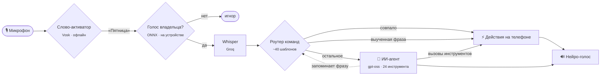

<div align="center">


<br>

[English](README.md) &nbsp;|&nbsp; **Русский**

<br>

[](https://github.com/n1dlee/friday-mobile/releases)
[](https://github.com/n1dlee/friday-mobile/releases)
[](https://github.com/n1dlee/friday-mobile/actions/workflows/ci.yml)
[](LICENSE)

[](#-установка)
[](https://kotlinlang.org)
[](https://developer.android.com/jetpack/compose)
[](https://groq.com)
[](https://onnxruntime.ai)

<br>

*Скажите «Пятница». Она ответит — и сделает.*

<br>

<a href="https://github.com/n1dlee/friday-mobile/releases/latest"></a>

</div>

---

Friday — персональный голосовой ассистент для Android в духе J.A.R.V.I.S. и F.R.I.D.A.Y. из «Железного человека». Она молча ждёт своё имя, слушается только голоса владельца и сама делает дело на телефоне: будильники, звонки, сообщения, музыка, настройки, календарь, почта. Если просьба не подходит ни под одну готовую команду, её разбирает языковая модель с инструментами, и Friday сообщает только о том, что действительно сделано.

> [!NOTE]
> Friday — личный проект в стадии **preview**. Нужен бесплатный [ключ Groq API](https://console.groq.com/keys) и 64-битный телефон на Android 8.0+. Интерфейс и голос настроены на **русский и английский**.

## ✨ Возможности

<table>
<tr>
<td width="50%" valign="top">

### 🎙️ Тихое слово-активатор
Распознавание «Пятницы» офлайн на [Vosk](https://alphacephei.com/vosk/). Ни звуков, ни системного значка микрофона, ни звука в сеть, пока имя не произнесено.

### 🔐 Только ваш голос
Модель проверки диктора на устройстве (ResNet34, ONNX Runtime) проверяет и слово-активатор, и саму команду. Чужой голос или телевизор просто игнорируются.

### ⚡ Два уровня мозга
Около 40 повседневных команд телефон выполняет сам за миллисекунды. Остальное разбирает ИИ-агент с **24 инструментами**. Фразы, которые агент разобрал, **запоминаются**: в следующий раз ИИ уже не нужен.

</td>
<td width="50%" valign="top">

### 🧭 Решает как человек
«Напиши маме» — SMS, WhatsApp или Telegram в зависимости от страны её номера, вашей страны и мессенджеров, в которых она есть. «Позвони маме» за границу — звонок в WhatsApp. Каждый выбор Friday объясняет.

### 💬 Читает и отвечает в чатах
Объявляет, кто звонит, читает WhatsApp/Telegram/SMS вслух и отвечает прямо из уведомления после вашего «да», не открывая приложение.

### 🌐 Знает актуальное
Поиск в интернете через браузерный инструмент Groq: новости, курсы, счёт матчей. Настоящая погода от [Open-Meteo](https://open-meteo.com). Арифметику считает калькулятор, а не модель «в уме».

</td>
</tr>
</table>

## 🗣️ Попробуйте сказать

| Вы говорите | Friday |
|---|---|
| *«Пятница… поставь будильник на 7:30 и напиши маме, что я опоздаю»* | Ставит будильник, затем открывает WhatsApp с готовым текстом для мамы (её номер за границей) |
| *«Позвони папе»* | Обычный звонок дома или звонок в WhatsApp, если он за границей, и говорит, какой выбрала |
| *«Что пишет мама?»* → *«Ответь, что я еду»* → *«Да»* | Читает переписку, зачитывает ваш ответ, отправляет |
| *«Включи Believer в спотифае»* · *«Останови музыку»* · *«Что сейчас играет?»* | Поиск и запуск, пауза, название трека из плеера |
| *«Кто выиграл последний чемпионат мира?»* | Ищет в интернете и отвечает со ссылкой на источник |
| *«Звук на 50»* · *«Выключи фонарик»* · *«Открой настройки блютуза»* | Телефон делает сам, без ИИ |
| *«Напомни завтра в 9 позвонить врачу»* | Событие в календаре с напоминанием |
| *«Напомни купить молоко»* | Напоминание по месту: сработает рядом с магазином |

## 🧠 Как это устроено



- **Сначала команды.** Повседневные просьбы до модели не доходят: быстрее, без токенов, и выдумать результат некому. На панели видно, кто ответил: `Friday · команда` или `Friday · ИИ`.
- **Агент закрывает пробелы.** Живая речь («закинь будильник на полвосьмого»), просьбы из нескольких частей, рассуждения. *Действовать* модель может только через инструменты и сообщает только то, что они вернули. За этим следят правило в промпте и пометка на каждом результате инструмента.
- **Экономно по умолчанию.** Для разговора модель получает лёгкий набор инструментов (~1 тыс. токенов). Полный набор инструментов телефона она запрашивает сама, когда он нужен.
- **Честно о неудачах.** Если «Часы» не создали будильник, Friday проверит это через `AlarmManager` и скажет как есть, а не «готово».

## 📥 Установка

1. Скачайте **`Friday-x.y.z.apk`** из [последнего релиза](https://github.com/n1dlee/friday-mobile/releases/latest) и установите. Разрешите установку из браузера, если Android спросит.
2. Откройте **Настройки** в Friday:
   - вставьте **ключ Groq API** (бесплатно на [console.groq.com](https://console.groq.com/keys));
   - **скачайте голосовую модель** (~45 МБ, один раз) и включите **слово-активатор**;
   - **запишите голосовой профиль**: восемь коротких фраз, около минуты.
3. Выдавайте разрешения по мере того, как их просят функции: микрофон, поверх других окон, контакты, звонки, доступ к уведомлениям (для чатов и музыки), геолокация (погода и напоминания по месту).
4. Скажите **«Пятница»**.

<details>
<summary><b>Разрешения и зачем они нужны</b></summary>

| Разрешение | Для чего |
|---|---|
| Микрофон, фоновая служба | Слово-активатор и команды |
| Поверх других окон | Панель, пока Friday слушает |
| Контакты, звонки, SMS | «Позвони маме», «напиши папе» |
| Доступ к уведомлениям | Чтение и ответы в чатах, управление музыкой, «что я пропустил» |
| Календарь | События и напоминания |
| Геолокация | Погода «здесь», напоминания у магазина |
| Камера, фонарик | «Сделай селфи», «включи фонарик» |
| Без ограничений батареи | Чтобы Samsung и Xiaomi не усыпляли слово-активатор |

</details>

## 🔐 Приватность

- **Ничего не записывается до слова-активатора.** Распознавание «Пятницы» работает офлайн. Голосовой профиль — это вектор из 256 чисел, и он никогда не покидает телефон.
- После слова-активатора **аудио команды** уходит в Groq для распознавания, **текст** — в Groq за ответом и в сервис чтения вслух Microsoft Edge для голоса.
- **Чаты хранятся только в памяти** и никуда не записываются. То, что Friday помнит о вас, лежит в локальной базе.
- Никакой аналитики, рекламы и аккаунтов. Ключ API хранится на телефоне и **не вшивается в приложение**.

## 🛠️ Технологии

| Слой | Технология |
|---|---|
| Интерфейс | Kotlin 2.1, Jetpack Compose, Material 3 |
| Архитектура | Clean Architecture (UI → use cases → репозитории), MVVM + StateFlow, Koin |
| Хранение | Room, WorkManager |
| Слово-активатор | Vosk (распознавание по грамматике) |
| Проверка голоса | wespeaker ResNet34 на ONNX Runtime, Kaldi-совместимые fbank на Kotlin |
| Речь → текст | Whisper large-v3-turbo через Groq |
| Языковая модель | `openai/gpt-oss-120b` / `20b` через Groq, потоковые вызовы инструментов, поиск |
| Текст → речь | Нейро-голоса Microsoft Edge (Svetlana / Emily) |
| Телефонные номера | Google libphonenumber |
| Качество | 600+ unit-тестов (JUnit, MockK, coroutines-test), detekt |

## 🏗️ Структура проекта

```text
app/src/main/java/com/friday/ai
├── agent/        ИИ-агент: инструменты, лёгкий/полный набор, калькулятор, выученные команды
├── command/      CommandExecutor и действия: телефон / планы / информация
├── core/         Чистая логика: роутер, парсеры, voice gate, fbank, люди и каналы
├── data/         Room, клиенты Groq / Gmail / погоды / Lazuri
├── domain/       Модели и use cases
├── service/      Служба слова-активатора, голосовой цикл, TTS, уведомления, почта
└── ui/           Экраны на Compose: чат, настройки, дашборд, оверлей
```

## 🔨 Сборка из исходников

Нужны **JDK 17 или 21** (не 25) и Android SDK 35.

```bash
git clone https://github.com/n1dlee/friday-mobile.git
cd friday-mobile
./gradlew assembleDebug          # APK в app/build/outputs/apk/debug/
./gradlew testDebugUnitTest      # unit-тесты
./gradlew detekt                 # статический анализ
```

Для сборки секреты не нужны: ключ Groq вводится в настройках приложения, а не в сборку. Без `keystore/friday.keystore` APK подписывается debug-ключом вашего SDK (см. [keystore/README.md](keystore/README.md)).

## 🗺️ Планы

- [x] Тихое слово-активатор, проверка диктора, непрерывный диалог
- [x] ИИ-агент с инструментами, выученные команды, поиск в интернете
- [x] Сообщения и звонки с учётом контекста (SMS / WhatsApp / Telegram)
- [x] Чаты из уведомлений: чтение, ответ, объявления
- [ ] Зашифрованное хранение ключа и мастер первого запуска
- [ ] Экран диагностики с выгрузкой логов
- [ ] Двусторонняя синхронизация с Lazuri Core (общая память с Friday Desktop)
- [ ] Сценарии-«протоколы», режимы «в машине» и «дома»
- [ ] Камера «что это?», Health Connect

## 🤝 Участие

Issues и pull request'ы приветствуются. Перед PR, пожалуйста, запустите:

```bash
./gradlew testDebugUnitTest detekt
```

Логику, которую можно написать без Android-классов, держите отдельно от них, чтобы её можно было покрыть тестами. Стиль — как в окружающем коде.

## 🙏 Благодарности

- Модель диктора: [wespeaker](https://github.com/wenet-e2e/wespeaker) `voxceleb_resnet34_LM`, лицензия [CC BY 4.0](https://creativecommons.org/licenses/by/4.0/). Веса переведены в хранение float16, в остальном без изменений.
- [Vosk](https://alphacephei.com/vosk/) (Apache 2.0) и его малая русская модель.
- [ONNX Runtime](https://onnxruntime.ai) (MIT), [libphonenumber](https://github.com/google/libphonenumber) (Apache 2.0), [OkHttp](https://square.github.io/okhttp/), [Koin](https://insert-koin.io).
- Данные о погоде: [Open-Meteo.com](https://open-meteo.com) (CC BY 4.0).
- Инференс: [Groq](https://groq.com).
- Вдохновлено J.A.R.V.I.S. и F.R.I.D.A.Y. из фильмов Marvel. Проект не связан с Marvel или Disney.

## ⭐ История звёзд

<a href="https://star-history.com/#n1dlee/friday-mobile&Date">
  <picture>
    <source media="(prefers-color-scheme: dark)" srcset="https://api.star-history.com/svg?repos=n1dlee/friday-mobile&type=Date&theme=dark">
    
  </picture>
</a>

## 📄 Лицензия

Распространяется по [лицензии MIT](LICENSE).

<div align="center">
<sub>Сделано с ☕ и множеством «Пятница?»</sub>
</div>
